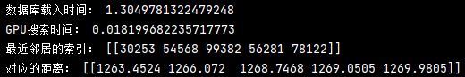
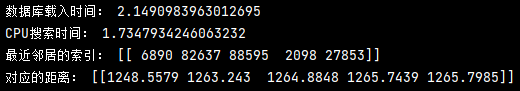

# faiss-gpu

how to install faiss-gpu

#### system and enviroment 

| ubuntu20.04     |
| --------------- |
| cuda11.0        |
| anaconda3       |
| python=3.7~3.9  |
| faiss-gpu=1.7.1 |

intall faiss-gpu

```shell
conda create -n faissgpu python=3.9
```

```shell
pip install numpy -i https://pypi.tuna.tsinghua.edu.cn/simple
```

```shell
pip install faiss-gpu==1.7.1 -i https://pypi.tuna.tsinghua.edu.cn/simple
```

#### faiss-gpu test

```shell
python faiss_gpu_test.py
```



#### faiss-cpu test

```shell
python faiss_cpu_test.py
```




